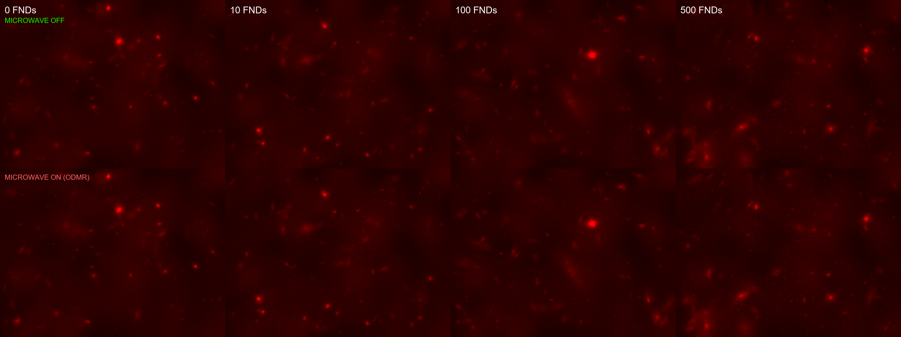
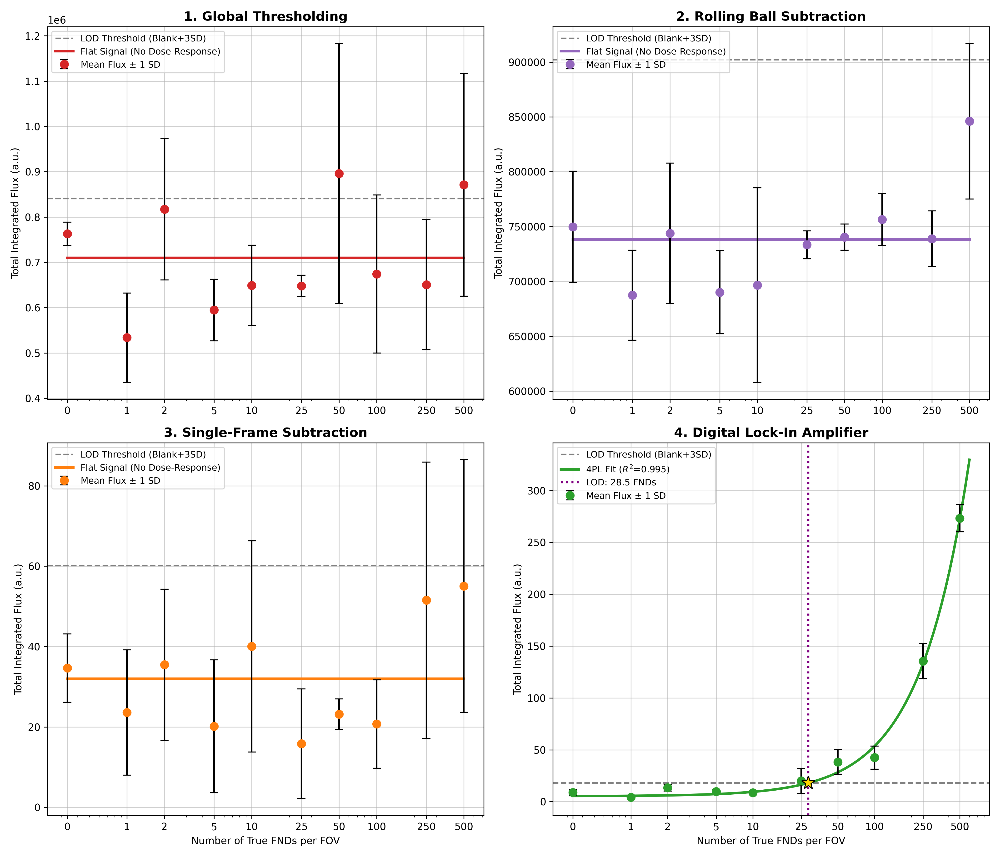
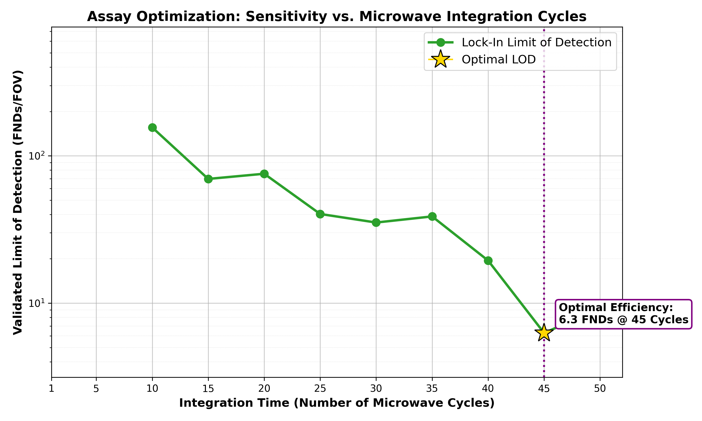

# FluoroLock: Digital Twin Simulator for Fluorescent Nanodiamond Assays


FluoroLock is a high-fidelity, physics-based digital twin simulator and benchmarking suite designed for **Fluorescent Nanodiamond (FND) Lock-In Optical Imaging**. 

This platform enables researchers to simulate realistic diagnostic imaging scenarios with ultra-low Limit of Detection (LOD), incorporating optical diffraction, fluid dynamics, hardware-induced drift, and complex biological backgrounds. It provides a robust framework to evaluate imaging algorithms against a hardware-aware Digital Lock-In Amplifier.

---

## 📊 Visual Showcase

### 1. Raw Simulation Data (The Digital Twin)
> **Figure 1:** A 2x4 grid showcasing the simulated Field of View across four FND concentrations. **(Simulated for 100nm FNDs under a 40x objective)**. The top row represents the microwave OFF state (max fluorescence), and the bottom row represents the microwave ON state (ODMR quenching).


### 2. Algorithm Benchmark Showdown
> **Figure 2:** Comparison of classical imaging techniques against the Digital Lock-In method **(n=3 replicates, 100nm FNDs)**. The graph illustrates how lock-in integration suppresses the background noise floor, lowering the LOD as integration cycles increase. Error bars represent the standard deviation of raw flux across replicates.


### 3. Lock-In Performance Optimization
> **Figure 3:** Dynamic performance of the Lock-In Amplifier over time **(n=3 replicates)**. The Limit of Detection (LOD) at each checkpoint is deterministically calculated by pooling the statistical variance across all replicates to ensure rigorous curve fitting. The algorithm automatically flags the optimal integration cycle (lowest LOD) required to achieve maximum assay sensitivity.


---

## ⚙️ Mechanism: How it Works

The core challenge in point-of-care fluorescence assays is **background autofluorescence** from biological samples. FluoroLock models a quantum-sensing solution using the Nitrogen-Vacancy (NV) centers in FNDs.

### The Physics Engine (`run_simulator.py`)
The simulator generates time-resolved image stacks by modeling:
* **Optical PSF Convolution:** Static and floating particles are convolved with an Airy disk Point Spread Function to mimic diffraction-limited imaging.
* **Cumulative Random Walks:** Simulates Brownian motion ($MSD \propto t$) and directional fluid flow, causing non-specific debris to wander or drift across the FOV.
* **Hardware Thermodynamics:** Models low-cost hardware constraints, including thermal focal sag (Z-drift), mechanical stage vibration (XY-drift), and microwave-induced thermal lensing.

### The Lock-In Pipeline (`run_lockin_optimization.py`)
The demodulation process follows a rigorous signal processing workflow:
1.  **Drift Correction:** Uses phase cross-correlation to track and reverse spatial drift relative to a reference frame.
2.  **Pixel-wise Demodulation:** Integrates and subtracts synchronized ON and OFF frames to isolate modulating FND signals from static or slowly bleaching background noise.
3.  **Statistical Isolation:** Employs Median Absolute Deviation (MAD) to dynamically set signal thresholds above the CMOS read noise floor.

---

## 🎛️ Documentation: Parameter Dashboard (`config.py`)

All environmental, physical, and hardware variables are centralized in `config.py`. Adjusting these settings allows you to simulate everything from pristine lab conditions to noisy, low-cost DIY hardware.

### 1. Global Experiment Settings
| Parameter | Description |
| :--- | :--- |
| `DATA_ROOT` | The master directory where generated `.tif` files and CSV results are saved. |
| `TARGET_FND_COUNTS` | Array defining the concentration gradient (e.g., `[0, 10, 100...]` FNDs per FOV). |
| `NUM_REPLICATES` | Number of distinct statistical repeats generated for the standard curve. |
| `CYCLES` | Number of microwave ON/OFF cycle pairs simulated per concentration. |
| `SIZE_X`, `SIZE_Y` | Pixel dimensions of the generated Field of View (FOV). |

### 2. Particle Physics & Quantum Yields
| Parameter | Description |
| :--- | :--- |
| `PARTICLE_MODE` | Toggles physics profiles (e.g., `"100nm"` vs `"600nm"` FNDs). |
| `PHOTON_YIELD` | Base intensity of a true FND point-source. |
| `ODMR_DROP` | The quantum contrast fraction (e.g., `0.02` = 2% fluorescence drop when microwave is ON). |
| `B1_MICROWAVE_GRADIENT` | Simulates non-uniform microwave field strength across the FOV. |

### 3. Optics & Camera Physics
| Parameter | Description |
| :--- | :--- |
| `LENS_POWER` | Label for the simulated objective lens format. |
| `PSF_SIGMA` | Blur radius controlling the sharpness of the Airy disk Point Spread Function. |
| `AIRY_RING_MULTIPLIER` | Amplifies optical diffraction side-lobes for realistic particle blooming. |
| `VIGNETTING_STRENGTH` | Controls radial darkening at the edges of the FOV due to lens physics. |
| `CAMERA_SATURATION` | Max pixel intensity threshold (`255` for 8-bit, `4095` for 12-bit sensors). |
| `SENSOR_CROSSTALK` | Gaussian blur applied strictly to read noise to simulate pixel-to-pixel bleed. |
| `EXCESS_SHOT_NOISE_MULTIPLIER`| Scales the natural Poisson noise inherent to bright photon arrivals. |

### 4. Background & Biological Noise
| Parameter | Description |
| :--- | :--- |
| `BACKGROUND_PHOTONS` | Baseline autofluorescence emitted by the fluid/buffer. |
| `BACKGROUND_CLOUDINESS`| Macro-scale unevenness of the background illumination. |
| `BACKGROUND_GRAININESS_STD`| Gaussian read noise injected by the camera sensor. |
| `BIO_GRAIN_SIZE` / `CONTRAST`| Micro-scale texture mapping representing dense protein/cellular matrices. |
| `JUNK_COUNT` | Number of highly bright, massive, textured debris blobs. |
| `FAKE_FND_COUNT` | Number of sub-resolution point-sources (e.g., trapped reporter antibodies) that do not blink. |
| `CLUSTERING_PROBABILITY`| The likelihood that particles (both FNDs and junk) stick together in clumps. |
| `NUM_DEFOCUS_DONUTS` | Large, out-of-focus artifacts modeled as ring shapes. |
| `NUM_SALT_PEPPER_DUST` | Extremely sharp, saturated single pixels simulating dust on the sensor. |

### 5. Thermodynamics & Fluid Dynamics
| Parameter | Description |
| :--- | :--- |
| `DRIFT_PX` | Total physical mechanical stage XY-drift over the integration time. |
| `Z_AXIS_FOCAL_DRIFT` | Increases the `PSF_SIGMA` (blur) over time due to thermal objective lens sag. |
| `THERMAL_LENSING_SHIFT` | XY index-of-refraction shift induced by microwave heating during the ON cycle. |
| `LASER_DIMMING` | Total linear photobleaching of the background over the scan duration. |
| `LASER_INSTABILITY` | Frame-to-frame randomized intensity flicker of the excitation source. |
| `FLUID_FLOW_X`, `FLUID_FLOW_Y`| Directional capillary fluid flow mapping (pixels per cycle). |
| `BROWNIAN_WOBBLE_STD` | Standard deviation of the cumulative random walk applied to floating particles. |
| `FLOATING_DEBRIS_FRACTION` | The percentage of biological junk actively moving in the fluid vs. adhered to the glass. |

### 6. Clinical Validation Filters
| Parameter | Description |
| :--- | :--- |
| `MIN_SIGNAL_RISE` | The required dose-response multiplier (e.g., `1.2x`) before a valid LOD curve is accepted. |

---

## 🚀 Installation & Usage

### Project Structure
```text
fluorolock/
├── config.py                  # Shared master dashboard
├── run_simulator.py           # Physics-based image generation
├── run_benchmark.py           # Multi-algorithm comparison suite
├── run_lockin_optimization.py # Focused Lock-In performance analysis
├── assets/                    # Visualization figures
└── data/                      # Simulation outputs and fused CSV results
```

### Quick Start
1.  **Clone & Install:**
    ```bash
    git clone https://github.com/YourUsername/fluorolock.git
    cd fluorolock
    pip install -r requirements.txt
    ```
2.  **Generate Data:**
    ```bash
    python run_simulator.py
    ```
3.  **Analyze Performance:**
    ```bash
    python run_benchmark.py
    ```

---

## 🧠 Downstream Research: AI Implementation
Datasets generated by FluoroLock are specifically structured to train spatiotemporal models like **Video Vision Transformers (ViViT)**. The explicit separation of Brownian motion from microwave-synchronized blinking provides a high-quality ground truth for training AI to differentiate between biological artifacts and target biomarkers in point-of-care diagnostics.

